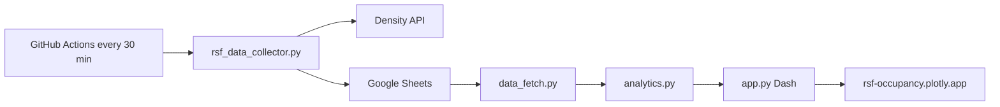

# RSF Occupancy Tracker

I collected Recreational Sports Facility occupancy for months, then turned it into a dashboard that answers “when should I go?” without hiding thin data.

**[Live dashboard](https://rsf-occupancy.plotly.app/)** · [Source](https://github.com/JohnnyMud/rsf-occupancy-tracker)

## What it answers

Berkeley students can see when the gym is actually busy before they walk over.

- Day × hour heatmap of average occupancy
- Quietest and busiest days, plus a 3-hour peak window
- Sample size on every insight (`n=` readings), not just a pretty average
- Summer months (May–August) off by default — a different gym than the school year

## Architecture



GitHub Actions runs [`.github/workflows/data_collection.yml`](.github/workflows/data_collection.yml) on a 30-minute cron. [`rsf_data_collector.py`](rsf_data_collector.py) polls the campus Density sensors, skips closed hours in `America/Los_Angeles` (DST included), de-dupes half-hour slots, retries flaky HTTP, and appends `% of capacity` to Google Sheets.

The dashboard does not chart raw rows. [`data_fetch.py`](data_fetch.py) loads the sheet, reconciles legacy timestamps, and masks closed-hour cells as NaN. [`analytics.py`](analytics.py) computes insights with explicit missing-day and sample-size behavior. [`app.py`](app.py) is the Plotly Dash UI. [`tests/`](tests/) covers those cases, not just that a chart renders.

## Why Google Sheets

For a single gym series, Sheets is a zero-ops store you can inspect in a browser. GitHub Actions already authenticates with a service account, so there is no database to host, migrate, or babysit.

If this grew past a personal dashboard, I would keep the collector write path and swap Sheets for Postgres (SQLite first, locally). The spreadsheet would stop being the API.

## What the analysis has to survive

Real collection is messier than a class dataset:

- Older rows used `pst_timestamp` / `timestamp` instead of UTC; the loader fills gaps instead of dropping history
- Closed hours (Saturday after 6 PM, weekday mornings before 7) stay NaN on the heatmap, not zero occupancy
- Insights refuse empty data and label thin samples instead of implying a full week
- May–August is a different occupancy regime, so school-year is the default view

## Run locally

Python 3.13 and [uv](https://docs.astral.sh/uv/).

```bash
uv sync
cp .env.example .env   # fill in secrets; put credentials.json in the repo root
uv run python app.py
```

Collector (during gym hours, or `FORCE_COLLECTION=true`):

```bash
uv run python rsf_data_collector.py
```

Tests:

```bash
uv run pytest
```

Secrets live in `.env` / `credentials.json` locally, and in GitHub Actions secrets for the scheduled job. See [`.env.example`](.env.example).

## Deploy

Plotly Cloud hosts `app.py` at [rsf-occupancy.plotly.app](https://rsf-occupancy.plotly.app/). The collector is independent: Actions keeps writing to Sheets even if the dashboard is down.
